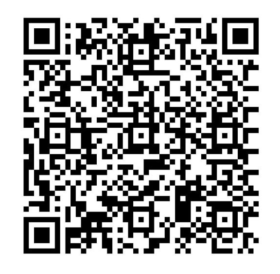

# Mineração de Textos para Cientistas Sociais

A análise quantitativa de textos, abre uma nova dimensão de investigação nas ciências sociais. o acesso a grandes *corpora* de documentos em forma digital, amplia sobremaneira as fontes da pesquisa mas ultrapassa rapidamente a forma tradicional de se analisar conteúdos textuais: leitura, compreensão e comparação com materiais já conhecidos. Longe de se tornar obsoleta, a cognição humana aplicada a documentos através da leitura, torna-se muito mais eficiente ao se aliar às modernas técnicas de mineração de texto.

A seleção de assuntos para inclusão neste livro é baseada na demanda dos leitores e também em desenvolvidos previamente por mim. Dê sua sugestão que farei o possível para atender as demandas da comunidade.

Este livro está baseado em uma combinação de cursos sobre o assunto ministrados por [mim](https://github.com/fccoelho) ao longo dos anos. Procuro manter o conteúdo acessível a pessoas com menos experiência em programação em Python. Caso você, leitor, se depare com trechos técnicamente muito avançados, fique à vontade para abrir uma `issue` explicando como acha que podemos tornar o conteúdo mais acessível.

Caso queira apoiar este projeto, faz um PIX de qualquer valor, usando o código QR abaixo:

